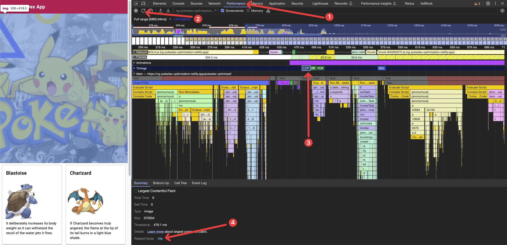

# Building a superfast portfolio page

Slides: [slides.com](https://slides.com/dimeloper/building-a-super-fast-portfolio-page)

## Web Vitals review

### Prerequisites for the Web Vitals analysis

- Install Google Chrome: https://www.google.com/chrome/

### Core Web Vitals Examples

- Bad example: https://ng-pokedex-optimization.netlify.app/pokedex-bad
- Good example: https://ng-pokedex-optimization.netlify.app/pokedex-optimized

To detect the LCP element in our webpage we can use the performance section of
our Chrome dev tools as such:

## Building our own portfolio page

## Prerequisites for the coding part

- Install GIT
    - Mac: `brew install git`
    - Linux: `sudo apt-get install git`
    - Windows: Download installer from: https://git-scm.com/downloads
- Install Node and NPM
    - Mac: `brew install node`
    - Linux: `sudo apt-get install nodejs`
    - Windows: Download .msi installer from: https://nodejs.org/en/download

You can verify that the required tools are available by opening a new terminal and checking
their versions: `git --version`, `nodejs -v` and `npm -v`.

## Kick off a new Astro project

`npm create create astro@latest`

Choose your project name, include Typescript, initialise a Git repository.

## Add tailwind

Go into the project directory and run:
`npm run astro add tailwind`